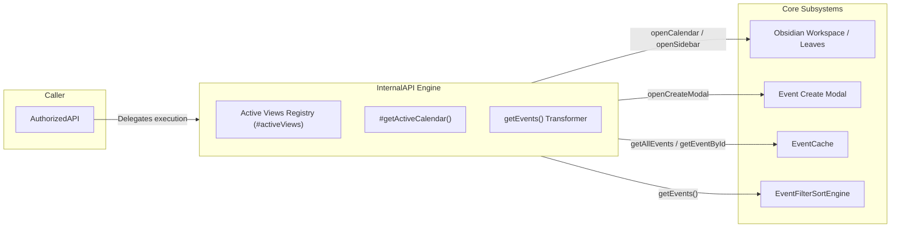

# Internal API Dispatcher Architecture

!!! abstract "Engine Overview"
    The [`InternalAPI`](../../../src/api/InternalAPI.ts#L27) class is the internal execution engine. Unlike `PublicAPI` and `AuthorizedAPI`, `InternalAPI` does not perform scope checks or token validation. It holds raw active view references, opens Obsidian workspace leaves, launches modals, and bridges requests directly to [`EventCache`](../system/eventcache.md) and [`EventFilterSortEngine`](../system/event-filtering-sorting.md).

---

## 1. Subsystem Architecture & Responsibilities

Source anchor: [`src/api/InternalAPI.ts#L27`](../../../src/api/InternalAPI.ts#L27)

`InternalAPI` acts as an unexposed internal proxy singleton managed by [`PluginState`](../system/core-systems.md).



---

## 2. Active View Tracking & Calendar Focus

`InternalAPI` maintains an internal set `#activeViews` of currently open `CalendarView` leaves:

```typescript
export class InternalAPI {
  #activeViews: Set<CalendarView> = new Set();

  public registerView(view: CalendarView) {
    this.#activeViews.add(view);
  }

  public unregisterView(view: CalendarView) {
    this.#activeViews.delete(view);
  }

  #getActiveCalendar(): Calendar | null {
    for (const view of this.#activeViews) {
      if (view.fullCalendarView) {
        return view.fullCalendarView;
      }
    }
    return null;
  }
}
```

### Workspace Actions

* **`openCalendar()`**: Queries `app.workspace.getLeavesOfType(FULL_CALENDAR_VIEW_TYPE)`. If no non-sidebar leaf exists, creates a new tab leaf; otherwise triggers `onOpen()` on existing leaves.
* **`openSidebar()`**: Queries `FULL_CALENDAR_SIDEBAR_VIEW_TYPE`. If not present, creates a leaf in the right sidebar (`workspace.getRightLeaf(false)`), sets view state, and calls `revealLeaf()`.
* **`changeView(viewName)`**: Resolves the active FullCalendar instance via `#getActiveCalendar()`. If inactive, opens the calendar tab, waits 100ms for initialization, and calls `calendar.changeView(viewName)`.

---

## 3. Event Querying & Normalization Pipeline

Source anchor: [`src/api/InternalAPI.ts#L112-L142`](../../../src/api/InternalAPI.ts#L112-L142)

When `getEvents(criteria, sorts)` is called, `InternalAPI` transforms raw cached event sources into queryable representations for [`EventFilterSortEngine`](../system/event-filtering-sorting.md):

```typescript
public getEvents(criteria: EventFilterCriteria, sorts?: EventSortCriteria[]): QueryableEvent[] {
  const allSources = PluginState.getCache().getAllEvents();
  const queryables: QueryableEvent[] = [];

  for (const source of allSources) {
    for (const event of source.events) {
      if (!event.id) continue;
      const details = this.getEventDetails(event.id);

      const q = EventFilterSortEngine.fromStoredEvent({
        id: event.id,
        event: details ? details.event : event.event,
        calendarId: details ? details.calendarId : source.id,
        location: details && details.location ? { ... } : null
      });
      q.rawEvent = event;
      queryables.push(q);
    }
  }

  return EventFilterSortEngine.query(queryables, criteria, sorts);
}
```

### `ApiEventDetails` Type Contract
```typescript
export type ApiEventDetails = {
  event: OFCEvent;
  calendarId: string;
  location: EventLocation | null;
} | null;
```

---

## 4. Full Internal State Access

For applications granted `system:full-access` scope, [`AuthorizedAPI.getInternalState()`](public-api.md#3-authorizedapi-interface-specification) returns direct references to core singletons:

```typescript
getInternalState: () => ({
  plugin: PluginState.getPlugin(),
  settings: PluginState.getSettings(),
  cache: PluginState.getCache(),
  providerRegistry: PluginState.getProviderRegistry(),
  internalAPI: PluginState.getInternalAPI()
})
```

!!! warning "Developer Caution"
    Directly mutating state retrieved via `getInternalState()` bypasses validation, reactive indexing, and scope logging. Use standard `AuthorizedAPI` mutation methods whenever possible.

---

[Back to API Index](index.md) · [Overview](overview.md) · [Public JS API](public-api.md) · [Recipes & Blueprints](recipes-blueprints.md)
