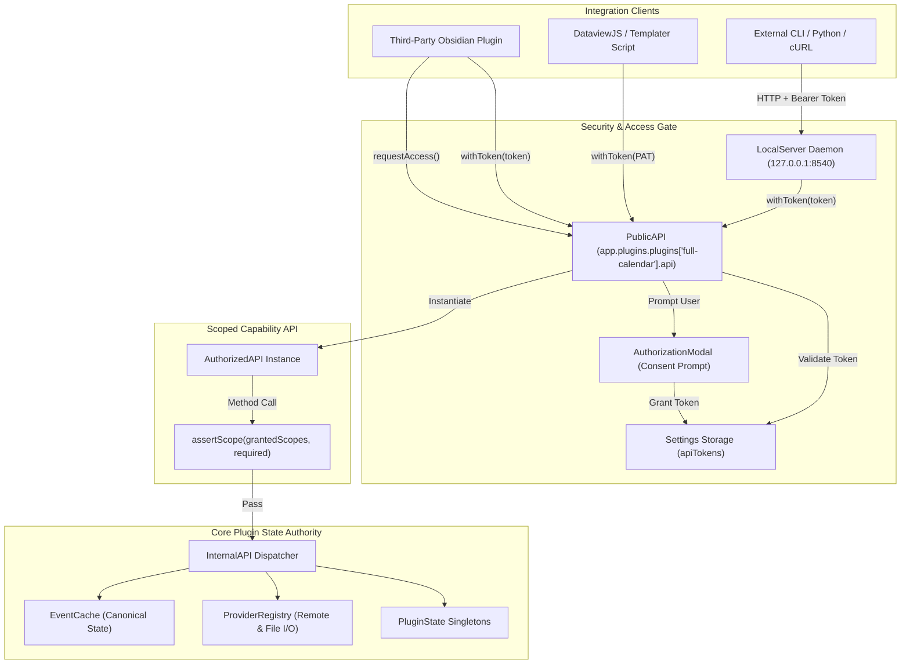
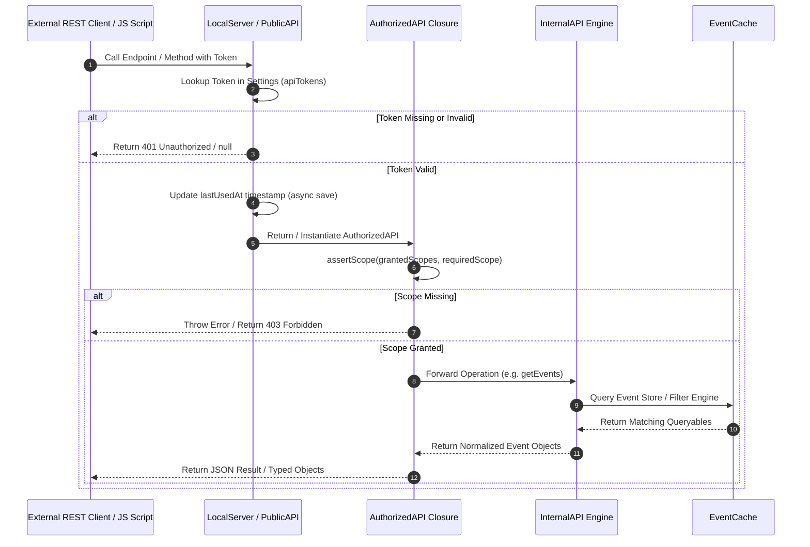

# API Architecture Overview

!!! abstract "Core Concept"
    Full Calendar Remastered exposes a unified, scope-gated API layer that powers both **in-vault JavaScript integrations** (third-party plugins, DataviewJS, Templater) and **external REST client scripts** (cURL, Python, CLI tools). All requests funnel through capability checks into [`InternalAPI`](internal-api.md) and [`EventCache`](../system/eventcache.md).

---

## High-Level System Architecture

The API architecture employs a strict **Bouncer Design Pattern**. Third-party callers never hold direct references to plugin singletons or internal memory stores. Instead, they receive a scoped [`AuthorizedAPI`](public-api.md#the-authorizedapi-interface) instance generated by [`PublicAPI.withToken()`](public-api.md#token-authentication--validation).

---

## Component Ownership Matrix

| Layer | Responsibility | Must Own | Must NOT Own |
|---|---|---|---|
| [`PublicAPI`](public-api.md) | Entry point attached to `app.plugins.plugins['full-calendar'].api`. Manages access token lookup, modal prompts, and legacy token migration. | Token validation, modal dispatching, PAT resolution. | Direct event data, file operations, HTTP server logic. |
| [`LocalServer`](rest-server.md) | Embedded Node.js HTTP listener (`127.0.0.1:${port}`). Parses HTTP requests, CORS headers, and Bearer tokens. | Port binding, HTTP routing, JSON body parsing. | Business logic, cache filtering engines, UI state. |
| [`AuthorizedAPI`](public-api.md) | Ephemeral closure wrapper implementing authorized API calls. Enforces `assertScope()` per method call. | Scope verification, forwarding calls to `InternalAPI` or `EventCache`. | Persistent token storage, raw internal singletons. |
| [`InternalAPI`](internal-api.md) | Execution engine bridging API requests to workspace leaves and cache engine. | Active view tracking, calendar tab opening, view changing. | Client permission checking, HTTP response formatting. |
| [`EventCache`](../system/eventcache.md) | Single source of truth for cached events and event index operations. | In-memory event index, mutation dispatching, file sync. | API token validation, UI view state management. |

---

## Request Execution Lifecycle

---

## Security Model & Sandbox Guarantees

1. **Process Boundary Isolation**: Third-party plugins cannot access internal data structures (`EventCache`, `ProviderRegistry`) directly without possessing a token with `system:full-access` scope.
2. **Localhost Restriction**: The REST server (`LocalServer`) forces network interface binding to `127.0.0.1`. Requests originating outside local loopback are rejected by the operating system kernel network stack.
3. **Mobile Platform Exclusions**: Obsidian runs on desktop (Electron/Node.js) and mobile (Capacitor/WebView). The [`LocalServer`](rest-server.md) detects mobile platforms via `PluginState.isMobile()` and disables the HTTP listener, avoiding mobile runtime crashes while keeping the JS `PublicAPI` available.
4. **Token Persistence**: Personal Access Tokens (PATs) and plugin authorization records are persisted securely in Obsidian's plugin configuration (`data.json` under `apiTokens`).

---

## Reading Order & Detailed References

1. **[Public JS API](public-api.md)**: JS entry points, `requestAccess()`, and complete `AuthorizedAPI` method contracts.
2. **[REST Server Specification](rest-server.md)**: HTTP REST routes, schemas, headers, status codes, and cURL examples.
3. **[Scopes & Authorization](scopes-permissions.md)**: Detailed breakdown of permissions, risks, and token storage format.
4. **[Internal API Engine](internal-api.md)**: View tracking, workspace leaf resolution, and cache querying mechanics.
5. **[Recipes & Blueprints](recipes-blueprints.md)**: Complete recipes for plugins, DataviewJS, Templater, Python, and shell scripts.

---

[Back to API Index](index.md) · [Public JS API](public-api.md) · [REST Server](rest-server.md) · [Scopes & Permissions](scopes-permissions.md)
