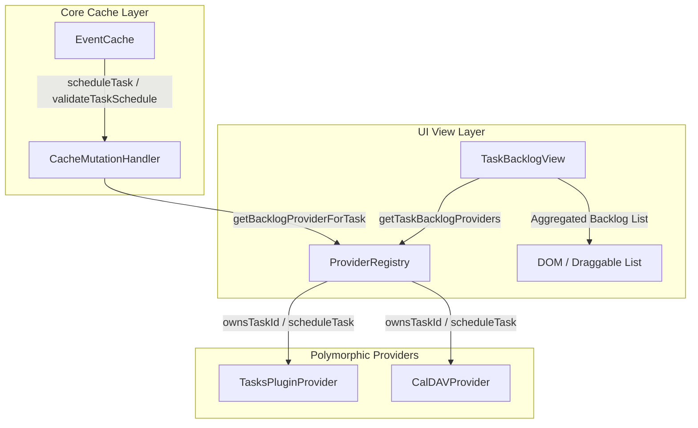

# Generalized Task Backlog Panel Architecture

The Task Backlog is a unified, extensible framework designed to aggregate, display, and schedule undated tasks from multiple provider sources. It is decoupled from any specific source implementation, adhering strictly to **SOLID** and **DRY** principles.

---

## 1. Core Architectural Overview

The task backlog is structured around a polymorphic design where the core cache and view layers communicate with task sources via the `TaskBacklogProvider` interface. The `ProviderRegistry` orchestrates active providers, and `TaskBacklogView` aggregates backlog tasks dynamically.



---

## 2. Core Contracts (`TaskBacklogProvider`)

Every calendar source that wants to expose backlog tasks to the side panel must implement the `TaskBacklogProvider` interface:

```typescript
export interface TaskBacklogProvider {
  // Metadata & Discovery
  getTaskBacklogInfo(): TaskBacklogInfo;
  getTaskBacklogItems(): Promise<TaskBacklogItem[]>;

  // Optional CUD actions
  createTaskBacklogItem?(title: string): Promise<TaskBacklogItem>;
  openTaskBacklogItem?(taskId: string): Promise<void>;
  refreshTaskBacklogItems?(): Promise<TaskBacklogItem[]>;

  // Polymorphic Hooks (SOLID / Open-Closed Principle compliance)
  ownsTaskId(taskId: string): boolean;
  scheduleTask(taskId: string, date: Date, allDay?: boolean): Promise<void>;
  validateTaskSchedule?(taskId: string, date: Date): Promise<{ isValid: boolean; reason?: string }>;
}
```

---

## 3. Dynamic Aggregation & Non-Blocking Loading

To prevent blocking UI rendering and avoid memory exhaustion, the backlog utilizes a highly optimized loading strategy:

1. **Parallel Execution**: Aggregation query `loadTasks()` invokes all active backlog providers concurrently using `Promise.allSettled()`, preventing a single slow remote provider (e.g. CalDAV) from blocking other local sources (e.g. Obsidian Tasks).
2. **On-Demand Cache Warming**: Local providers (such as Obsidian Tasks) load and warm cache pools in the background. Remote providers (CalDAV) leverage asynchronous GET/REPORT caching, fetching objects only on-demand and updating their cached counts incrementally.
3. **Chunked Pagination**: Renders backlog items in paginated chunks (defaulting to 200 items per page), avoiding DOM overload and maintaining extremely fast layout rendering even with thousands of undated tasks.

---

## 4. Polymorphic ID Routing & DRY Helpers

Task IDs are serialized string identifiers containing sufficient metadata for mapping. For CalDAV, IDs utilize the `caldav::${encodeURIComponent(calendarId)}::${encodeURIComponent(uid)}` standard, whereas Obsidian Tasks utilize `filePath::lineNumber`.

1. **Polymorphic Search**: When a task is dropped on the calendar, the cache handler routes it via `ownsTaskId(taskId)`:
   ```typescript
   const provider = ProviderRegistry.getBacklogProviderForTask(taskId);
   await provider.scheduleTask(taskId, date, allDay);
   ```
2. **Backwards Compatibility Fallbacks**: CalDAV provider's `scheduleTask` and `validateTaskSchedule` feature a fallback system which automatically processes both fully qualified backlog IDs (`caldav::...`) and raw `taskUid` strings, safeguarding direct unit tests and integration endpoints.

---

## 5. View-Level Fuzzy Search & Filename Filtering

Search matches are evaluated across three haystacks: title, subtitle (which carries file path details), and provider name. 

To safeguard the legacy search workflows of Obsidian Tasks users:
- **Filename Extraction**: If `subtitle` is a file path, the view automatically extracts the base filename (stripping directory folders and line number colons) and appends it to search haystacks:
  ```typescript
  const baseName = subtitle.split(/[/\\]/).pop()?.split(':')[0]?.trim() || '';
  if (baseName && baseName !== subtitle) {
    haystacks.push(baseName);
  }
  ```
- **Fuzzy Subsequence Matching**: Evaluates user keywords using token-based fuzzy sequence matching, facilitating quick lookups across large vaults.

---

## 6. Layout & UX Redesign: Persistent Fixed Footer

To make the interface extremely intuitive and cleanly separate filtering/viewing operations from task creation, the `TaskBacklogView` implements a custom dual-container layout:

1. **Scrollable Content (`.tasks-backlog-content`)**:
   - The top portion of the side panel occupies a flexible height container that manages the main backlog list, category selectors, fuzzy search input, pagination controls, and status messages.
   - It is styled with `flex: 1; overflow-y: auto;` to handle thousands of items gracefully while maintaining fixed view elements in place.

2. **Persistent Fixed Footer (`.tasks-backlog-footer`)**:
   - Placed at the very bottom of the sidebar view.
   - Constrained to `flex-shrink: 0` with a solid background matching the theme’s secondary colors, and a clean top border separating it from the scrollable list.
   - Encapsulates the **"Add unscheduled task"** header, provider/source selector, and title text inputs.
   - Includes a user-facing helper text block containing a "Learn more" anchor link pointing directly to the official documentation (https://obsidian-full-calendar-remastered.github.io/plugin-full-calendar/) for rapid, context-aware user learning.

This clear separation ensures that task creators do not mistake search filtering elements for creation controls, maximizing workflow intuition.

