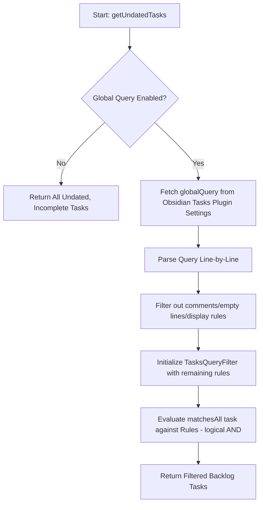

# Tasks Integration Architecture

!!! abstract "Core Contract"
    The Tasks integration is a **cache-subscriber provider** that performs surgical markdown I/O. It treats the [Obsidian Tasks](https://github.com/obsidian-tasks-group/obsidian-tasks) plugin as its data authority and the `EventCache` as its synchronization target.

This provider family context is defined in [Provider Architecture](architecture.md).

## Data Flow & Synchronization

Unlike other providers that crawl files directly, the Tasks provider is an event-driven system:

1.  **Subscription**: On initialization, the provider subscribes to `obsidian-tasks-plugin:cache-update`.
2.  **In-Memory Mirroring**: It maintains an internal `allTasks` array which is a transformed view of the Tasks plugin's raw cache.
3.  **Differential Sync**: Every time the Tasks cache updates, the provider performs a granular diff against its previous state and emits batch updates (`additions`, `updates`, `deletions`) to the global `ProviderRegistry`.

For cache authority and mutation sequencing, see [EventCache Contract](../system/eventcache.md).

## Surgical Markdown I/O

When a user drags a task on the calendar or toggles its completion state, the provider performs **Surgical Replacement**:

- **Targeting**: It uses the file path and line number provided by the Tasks cache.
- **Injection Logic**: It uses regex to inject or update date emojis (`⏳`, `🛫`, `📅`) and time tokens while preserving:
    - Task descriptions.
    - Existing metadata (created dates, recurrence, etc.).
    - **Block Links** (`^uuid`): The regex ensures that injected data is placed *before* any block links at the end of the line.

## Time Format Contract

The Tasks integration has an explicit write-format setting:

- `settings.tasksIntegration.taskDisplayFormat`
    - `dayPlanner` (default): write time at the start of the task line.
    - `standard`: write parenthesized time near date metadata.

Settings ownership and propagation model: [Settings Architecture](../settings/architecture.md).

### Write behavior

For timed tasks, the provider writes one of the following:

- Day Planner range: `- [ ] 5:00 - 19:00 Task title ⏳ 2026-05-02`
- Day Planner single: `- [ ] 14:30 Task title ⏳ 2026-05-02`
- Standard range: `- [ ] Task title (5:00 AM-7:00 AM) ⏳ 2026-05-02`
- Standard single: `- [ ] Task title (14:30) ⏳ 2026-05-02`

All-day updates remove time tokens in either format.

### Read behavior

Parsing is format-agnostic and supports both Day Planner prefix and legacy parenthesized syntax. This means:

- Existing legacy tasks remain fully compatible.
- Newly written day-planner tasks are parsed identically into `startTime` / `endTime`.
- No mandatory bulk migration is required for correctness.

## Optimistic UI Updates

To ensure the calendar feels responsive despite file I/O latency:
1.  The provider modifies the markdown file asynchronously.
2.  It simultaneously pushes an **Optimistic Update** to the `EventCache` with the new expected state.
3.  The eventual file change triggers a fresh cache update from the Tasks plugin, which the provider reconciles to confirm the operation.

This follows the canonical mutation path in [EventCache Contract](../system/eventcache.md#mutation-lifecycle-authoritative-path).

## Date Logic & "No Fallback" Policy

The provider enforces a strict mapping policy to maintain data integrity:
- **Consistency**: It only reads from the *specific* date target configured by the user (Scheduled, Due, or Start).
- **Reasoning**: This prevents "ghosting" where a task appears on the calendar under one date but is tracked in the backlog under another, ensuring a predictable user experience.

## Backlog View Filtering Contract

Backlog filtering is split by responsibility:

- **Provider-level filter** (`TasksPluginProvider.getUndatedTasks()`): decides which tasks are backlog candidates using `backlogDateTarget` and completion state.
- **Backlog Query Filter** (proposed): applies a Full Calendar-owned query string from `settings.tasksIntegration.backlogQuery` to backlog candidates before they are exposed to the backlog view.
- **Global Query Filter** (`TasksQueryFilter`): If the setting `includeGlobalQueryInBacklog` is enabled, the provider fetches the global query string defined in Obsidian Tasks (`app.plugins.plugins['obsidian-tasks-plugin']?.settings?.globalQuery`) and filters backlog tasks accordingly.
- **View-level filter** (`TasksBacklogView`): applies client-side fuzzy filtering over candidate tasks by title and file path.

View-layer boundary reference: [Views Architecture](../views/architecture.md).

The view-level fuzzy filter is intentionally non-destructive: it does not mutate provider state and only narrows visible rows in the panel.

### Proposed Dedicated Backlog Query

The dedicated backlog query should be a persisted Full Calendar setting rather than an Obsidian Tasks plugin setting:

```ts
interface TasksIntegrationSettings {
  backlogQuery?: string;
}
```

Suggested evaluation order in `TasksPluginProvider.getUndatedTasks()`:

1. Select incomplete tasks missing the configured `backlogDateTarget`.
2. If `tasksIntegration.backlogQuery` is non-empty, filter tasks with `new TasksQueryFilter(backlogQuery)`.
3. If `includeGlobalQueryInBacklog` is enabled, filter the remaining tasks with the Tasks plugin `globalQuery`.
4. Map the final tasks to `ParsedUndatedTask` for the backlog view.

The backlog query and global query are combined with logical AND semantics. Each query line is already evaluated with AND semantics by `TasksQueryFilter`, so applying both filters sequentially preserves a simple mental model: a backlog task must satisfy every supported backlog rule and every supported global rule.

The settings UI should expose this as a multiline text box in **Integrations → Tasks Plugin Integration**, near the existing **Include global query in the backlog** toggle. Saving the field should call `PluginState.saveSettings()` and `PluginState.getProviderRegistry().refreshBacklogViews()` so the sidebar updates immediately.

The feature should reuse `TasksQueryFilter` instead of introducing another parser. This keeps supported syntax identical between the global query fallback and the dedicated backlog query, including ignored display/layout lines and unsupported lines.

### Global Query Filtering Architecture (`TasksQueryFilter`)

Adhering strictly to **SOLID** and **DRY** principles, the parsing and evaluation of Obsidian Tasks global query statements are encapsulated in the dedicated `TasksQueryFilter` class.

- **Single Responsibility Principle (SRP)**: `TasksQueryFilter` handles exclusively query parsing, operator mapping, and evaluation. It is fully decoupled from the UI and main `TasksPluginProvider` lifecycle.
- **Open/Closed Principle (OCP)**: Adding new fields or operators only requires updating internal `TasksQueryFilter` mapping dictionaries without modifying the core cache subscription registry.
- **DRY (Don't Repeat Yourself)**: Operator normalization (`include`/`includes`, `is`/`are`) and tag cleaning (removing `#` symbols) are unified under reusable matchers.

#### Supported Field & Operator Matrix

| Field | Description | Supported Operators | Normalization / Cleaning |
|---|---|---|---|
| `path` | Full filepath matching | `includes`, `does not include`, `is`, `is not`, `regex matches`, `regex does not match` | Evaluated against file's absolute path |
| `folder` | Parent folder matching | `includes`, `does not include`, `is`, `is not`, `regex matches`, `regex does not match` | Extracted as the substring of `filePath` up to the final slash |
| `description` | Task title matching | `includes`, `does not include`, `is`, `is not`, `regex matches`, `regex does not match` | Matcher uses the parsed, metadata-stripped task title |
| `tag` / `tags` | Multi-tag list matching | `includes`, `does not include`, `is`, `is not`, `regex matches`, `regex does not match` | Extracts `#tag` markers from both title and raw markdown line; matches are case-insensitive and ignore the leading `#` |
| `priority` | Priority level matching | `is`, `is not` | Maps emoji markers (`🔺` for `highest`, `⏫` for `high`, `🔼` for `medium`, `🔽` for `low`, `⏬` for `lowest`, none for `none`) to standard priority string keys |

#### Rule Execution Flow



---

[Provider Architecture](architecture.md) · [Event Cache](../system/eventcache.md) · [API Surface](../system/api-architecture.md)
