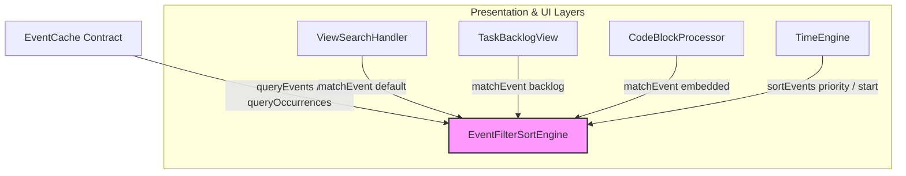

# Event Filtering and Sorting Architecture

!!! abstract "System MOC Integration"
    This page describes the design, execution flow, and implementation contract of the centralized **Event Filtering and Sorting Engine** (`EventFilterSortEngine`). It is a core component of the [Core Layer](overview.md#layer-model-at-a-glance) and operates in close coordination with the [EventCache Contract](eventcache.md) and [Event Storage System](event-storage.md).

---

## 1. Architectural Role and Layers

Historically, different modules computed matching, sorting, and filtering using localized, ad-hoc routines. The `EventFilterSortEngine` unifies all of these behaviors into a single pure, stateless helper class located under `src/core/EventFilterSortEngine.ts`. 

In the [Layer Model](overview.md#layer-model-at-a-glance), the engine sits in the **Core Layer**, serving as a stateless utility for both state orchestration and presentation layers:

* **Presentation Layer**: Used by [ViewSearchHandler](interop.md) and [CodeBlockProcessor](../../user/features/embedded_calendars.md) to shape the rendered DOM elements without duplicating business logic.
* **Core Layer Orchestration**: Used by [EventCache](eventcache.md) and [TimeEngine](core-systems.md) to calculate occurrences and filters before broadcasting state changes.



---

## 2. Core API and Data Contracts

### Normalized Event Representation: `QueryableEvent`
To ensure type safety and allow polymorphic queries across raw events, stored events, occurrences, and backlog items, the engine normalizes all event formats into a clean interface:

```typescript
export interface QueryableEvent {
  id: string;                 // Session ID or task ID
  uid?: string;               // Persistent ID if exists
  title: string;
  category?: string;
  subCategory?: string;
  description?: string;
  filePath?: string;
  calendarId?: string;
  calendarName?: string;
  startMillis?: number;       // Start time epoch (ms)
  endMillis?: number;         // End time epoch (ms)
  date?: string;              // ISO Date (yyyy-MM-dd)
  endDate?: string;           // ISO End Date (yyyy-MM-dd)
  allDay?: boolean;
  completed?: boolean | string;
  isTask?: boolean;
  rawEvent?: unknown;         // Reference to original source object (e.g. for backlog subtitle)
}
```

### Composable Filters: `EventFilterCriteria`
Queries are declared using composable filters, allowing concurrent or chained constraints:

```typescript
export interface EventFilterCriteria {
  calendarIds?: string[];
  categories?: string[];
  subCategories?: string[];
  filePathSubstring?: string;
  tags?: string[];
  isTask?: boolean;
  isCompleted?: boolean;
  excludeAllDayTasks?: boolean;
  dateRange?: {
    startMillis?: number;
    endMillis?: number;
  };
  textSearch?: {
    query: string;
    mode: 'default' | 'backlog' | 'embedded';
  };
}
```

---

## 3. High-Performance Text Search Modes

To maintain 100% backward compatibility, the text search component supports three specialized keyword matching strategies, matching the exact user-facing behaviors of the respective UI features:

| Mode | Target UI | Haystack Fields | Matching Strategy |
|---|---|---|---|
| **`default`** | [Main Calendar Search](interop.md) | `title`, `category`, `subCategory`, `description`, `filePath` | **Substring match** for all words; for tokens $\ge 4$ characters, checks if any haystack word has an **edit-distance $\le 1$** (fuzzy keyword matching). |
| **`backlog`** | [Unscheduled Tasks Backlog](../calendars/tasks-integration.md) | `title`, `subtitle` (filePath:line), `calendarName`, and base file name | **Substring match** or **fuzzy character-subsequence match** (characters in correct order) on any of the haystack components. |
| **`embedded`** | [Embedded Codeblocks](../../user/features/embedded_calendars.md) (`tagFilter`) | `title`, `description`, `category`, `subCategory` | Case-insensitive **substring match** check. |

---

## 4. Sorting Routines

Sorting is executed using declaratively supplied sorting arrays (`EventSortCriteria[]`), allowing nested secondary sorting (e.g. sort by start time, and then by title):

```typescript
export interface EventSortCriteria {
  field: 'start' | 'end' | 'title' | 'category' | 'priority';
  order?: 'asc' | 'desc';
}
```

### The Priority Sort Rule (TimeEngine)
For current/active event selection, the engine implements a unified **Priority Sort** matching the [TimeEngine](core-systems.md) invariants:
1. **Timed vs All-Day**: Timed events have higher priority than all-day events.
2. **End Time**: Events ending sooner have priority.
3. **Start Time**: Events starting earlier have priority.

---

## 5. Cache Integration Anchors

The engine is integrated as direct helper pipelines on the `EventCache` instance:

- **`queryEvents(criteria, sorts)`**: Queries the [EventStore](event-storage.md) for matching static `StoredEvent` items.
- **`queryOccurrences(criteria, sorts)`**: Queries chronological `EnrichedOFCEvent` occurrences computed by the [TimeEngine](core-systems.md).

---

## 6. Type Safety & Testing Contracts

The implementation strictly conforms to TypeScript and Obsidian Community linting guidelines:
* **No `any` Casts**: Uses type narrowing (`event.type === 'single'`) to resolve union member access cleanly, and defines strict shapes (like `BacklogItemShape`).
* **Strict Member Access**: Member retrieval is fully typechecked.
* **Stateless Pure Operations**: The engine itself holds no local memory structures, preventing memory leaks and timing issues.
* **Coverage Verification**: All filter/sort scenarios are fully covered in [Testing and Validation](testing.md) using the dedicated Jest test suite `src/core/EventFilterSortEngine.test.ts`.
