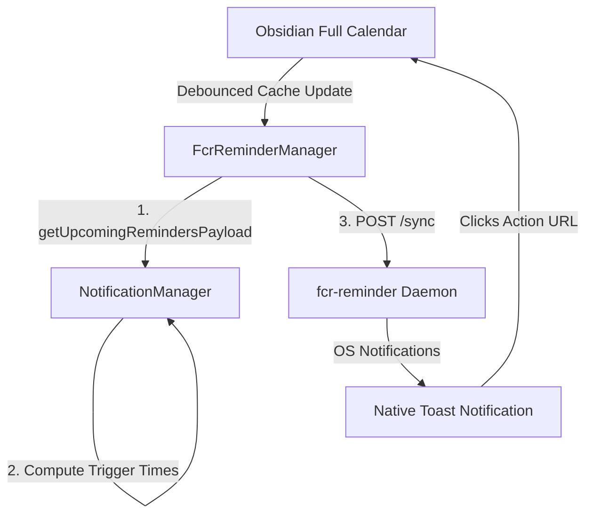

# FCR Reminder Companion Architecture

!!! abstract "Core Contract"
    The FCR Reminder Companion is an offline-first, native system notification extension. It synchronizes upcoming events with a lightweight persistent background daemon, ensuring that native, OS-level toast notifications fire even when Obsidian is completely closed.

---

## System Overview

To provide notification continuity without requiring Obsidian to run constantly in the background, the Full Calendar plugin delegates notification scheduling to a persistent background companion daemon. 



---

## Architectural Modularity and Centralized Calculation

In accordance with SOLID and DRY principles, **[NotificationManager](reminders-architecture.md) acts as the single source of truth** for all reminder logic:
1. **Unified Trigger Evaluation**: All calculations of event trigger times (using custom per-event `notify.value` or the global fallback `defaultReminderMinutes`) are owned by `NotificationManager.getTriggerTime()`.
2. **Payload Delegation**: The payload transmitted to the daemon is compiled exclusively via `NotificationManager.getUpcomingRemindersPayload()`, completely eliminating duplication of timing, formatting, and file-link mapping rules.

---

## Synchronization Protocol

### Debouncing and Gates
* **Global Master Toggle Gating**: The synchronization pipeline is strictly gated by both the global master reminders toggle (`settings.enableReminders`) and the companion-specific toggle (`fcrReminderCompanion.enabled`). If reminders are disabled globally, the companion sync pipeline is completely shut down.
* **Offline Resiliency**: `FcrReminderManager` queries `/status` on the daemon loopback address before attempting a sync. If offline, the sync is gracefully skipped to avoid network overhead.
* **Startup Liveness Retries and In-flight Aborts**: Upon startup or activation, if the daemon is not immediately reachable, `FcrReminderManager` performs up to 5 status checks spaced 3 seconds apart to accommodate slow daemon startup times. The background retry loop checks the active state before each attempt; if the integration is disabled or reminders are turned off mid-loop, the retry process is immediately aborted, blocking any eventual payload synchronization. If all active attempts fail, it displays a bold warning toast surviving for 15 seconds to notify the user.
* **Debounced Syncing**: To prevent system lag during rapid file updates, cache-change triggers are debounced by `800ms`.

### The Synchronization Payload
The `/sync` endpoint accepts a JSON array containing events starting/triggering within the next 24 hours. The structure of each payload item is:

```typescript
interface FcrReminderPayloadItem {
  id: string;              // Normalized, stable event session ID (appends timestamp for recurring instances)
  title: string;           // Truncated event title (Max 64 chars)
  body: string;            // Truncated event description (Max 256 chars)
  trigger_at_epoch: number; // Unix epoch timestamp (seconds) when the notification should fire
  action_url: string;      // URL encoded obsidian:// protocol deep link to the source file
}
```

### Action URL Deep Linking
To allow users to immediately open the event inside Obsidian upon clicking the OS toast, the `action_url` uses Obsidian's URI protocol:
```
obsidian://open?vault=<vault-name>&file=<url-encoded-file-path>
```

---

## Manual Synchronization Dispatch

In addition to background debounced sync loops, the system supports manual forced synchronization through two distinct integration paths:

1.  **Obsidian Command Palette**: Registered in `src/main.ts` with ID `full-calendar-sync-fcr-reminder`. The command utilizes a `checkCallback` block to dynamically register in the command interface only if `fcrReminderCompanion.enabled === true`.
2.  **NLP Command Routing**: Defined in `src/features/nlp/payloads/en.json` with the rule `sync_fcr_reminder` mapping regex `^(?:sync|run|update)\s+(?:fcr\s+)?(?:reminder\s+)?companion\b` to the `SYNC_FCR_REMINDER` intent. The NLP dispatcher in `src/features/nlp/dispatcher.ts` catches this intent and directly triggers `plugin.fcrReminderManager.syncToCompanion()`. See [NLP Engine Architecture](nlp-architecture.md).

Both dispatch paths compile the lookahead payload, transmit it to the daemon loopback, and show a confirmation toast on success.

---

## Alert Mutex (Obsidian Bypass)

To prevent duplicate alerts when Obsidian and the companion daemon are running concurrently, `NotificationManager` implements a mutex:
* When `fcrReminderCompanion.enabled` is `true`, standard Obsidian toast alerts (`new Notification(...)`) and their interactive modal popups are bypassed. See [Mutex and FCR Takeover](reminders-architecture.md#mutex-and-fcr-takeover).
* The offline background daemon assumes full ownership of active alerting.

---

### 📚 Related Resources

=== "Technical Deep-Dives"
    *   [Local Reminders Architecture](reminders-architecture.md) — Centralized trigger calculations, snoozing logic, and standard notification pipelines.
    *   [Event Cache Architecture](../eventcache.md) — The core in-memory event state machine and synchronization handlers.
    *   [NLP Engine Architecture](nlp-architecture.md) — Universal NLP orchestrator, parser rules, and command dispatch routing.

=== "User Manuals"
    *   [FCR Reminder Companion Guide](../../../user/features/fcr-reminder.md) — User setup guide, synchronization behaviors, and manual refresh options.

