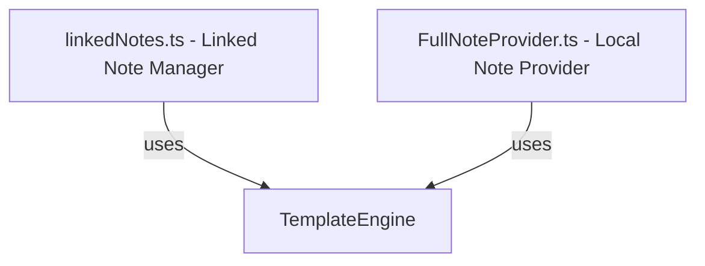

# Note Templating Architecture

!!! abstract "Decoupled Template Rendering Contract"
    The templating engine is a functional, pure rendering component designed to format event metadata into a Markdown body string. It is decoupled from filesystem, database, or settings storage side-effects, allowing it to be reused consistently across different features.

## Core Component

The templating capability is centered around the `TemplateEngine` class (`src/features/linked-notes/TemplateEngine.ts`).

### Class Design

`TemplateEngine` exposes a single, stateless, pure function:

```typescript
static render(
  template: string,
  event: OFCEvent,
  calendarName = '',
  instanceDate?: string
): string
```

- **Functional Purity**: The function has no side effects, does not read or write from the Obsidian vault directly, and does not require settings context. This guarantees consistent outputs for a given inputs array.
- **Dynamic Variable Resolution**: It parses double-braced syntax (e.g. `{{title}}`) via case-insensitive regular expressions and replaces them with corresponding fields from the input `OFCEvent` or fallback parameters.

---

## Architectural Principles & SOLID Boundaries

To maintain high structural integrity and adhere to DRY (Don't Repeat Yourself) principles:

### 1️⃣ Decentralized Usage (DRY)
Instead of replicating template rendering logic within individual features, both local note creation and remote event linking delegate to the same utility class:

- **Full Note Creation (`FullNoteProvider.createEvent`)**: Renders templates locally defined for a specific local calendar directory.
- **Linked Note Creation (`linkedNotes.ts`)**: Renders templates defined globally in settings for remote calendar notes.



### 2️⃣ Timezone and Locale Safety
- Dynamic date placeholders (like `{{date}}` and `{{timeString}}`) are computed via `luxon` using ISO standard dates and the system locale.
- When generating recurring instances, the `instanceDate` is passed explicitly to isolate formatting from runtime series boundaries.

---

## Integration Anchors

- [`src/features/linked-notes/TemplateEngine.ts`](file:///d:/Codes/plugin-full-calendar/src/features/linked-notes/TemplateEngine.ts) — The rendering engine logic.
- [`src/features/linked-notes/TemplateEngine.test.ts`](file:///d:/Codes/plugin-full-calendar/src/features/linked-notes/TemplateEngine.test.ts) — Test coverage verifying all placeholder replacements.
