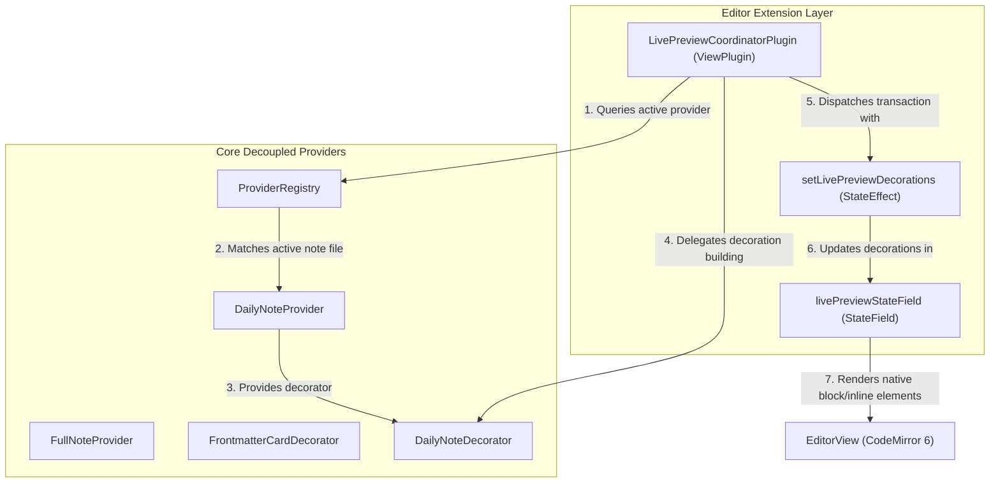

# Live Preview System Architecture

This document details the SOLID, DRY, and high-performance **Provider-Delegated Design Pattern** and state bridge architecture used to integrate CodeMirror 6 Live Preview decorations in Full Calendar Remastered.

---

## 1. SOLID Design: The Delegation & State Bridge Pattern

To avoid creating a monolithic CodeMirror manager that knows about concrete providers and specific parsing structures, the Live Preview subsystem employs a strictly decoupled **Registry Delegation Pattern** combined with a **StateField Bridge** to safely manage block widgets.

### The StateField Bridge

CodeMirror 6 enforces a strict rule: **Block decorations (`block: true` widgets) cannot be specified directly via ViewPlugins.** Doing so raises `RangeError: Block decorations may not be specified via plugins` and crashes the editor. 

To bypass this safety limit while maintaining dynamic, reactive updates, the coordinator uses a two-tier **StateField Bridge** architecture:
1. **`livePreviewStateField`**: A CodeMirror `StateField<DecorationSet>` registers decorations with the editor state via the `EditorView.decorations.from(livePreviewStateField)` facet.
2. **`LivePreviewCoordinatorPlugin`**: A generic `ViewPlugin` acts as the coordinator/observer. When cache or editor events trigger a redraw, it recalculates decorations and dispatches a transaction with the `setLivePreviewDecorations` `StateEffect` to safely update the `StateField`.



### High Cohesion (Single Responsibility Principle)
Visual representations (like inline event pills or frontmatter cards) are packaged directly inside their respective provider directories (e.g., `src/providers/dailynote/codemirror/` and `src/providers/fullnote/codemirror/`). This keeps data parsing logic and visual editor logic localized, preventing feature sprawl across boundaries.

### Open/Closed Principle (OCP)
The central `LivePreviewCoordinator` is a completely generic CodeMirror integration layer. It has **zero coupling** to concrete calendar types. It interacts strictly with the `CalendarProvider` and `LivePreviewDecorator` interfaces:
1. It queries the central `ProviderRegistry` to find the active provider for the currently open file.
2. If the provider implements `getEditorDecorator()`, it retrieves the cached decorator instance and delegates the decoration building.
3. Adding a new calendar source with custom editor decorations in the future requires **zero modifications** to the core editor registration layers!

---

## 2. Core Components

### `LivePreviewDecorator`
Exposes the core contract implemented by individual providers:
```typescript
export interface LivePreviewDecorator {
  getDecorations(
    view: EditorView,
    file: TFile,
    visibleRanges: readonly { from: number; to: number }[]
  ): DecorationSet;
}
```

### `LivePreviewCoordinatorPlugin`
Registered as an Obsidian Editor Extension, it acts as the primary event loop observer:
* **Lifecycle**: Listens for editor state transitions inside its `update(update: ViewUpdate)` loop.
* **Global Toggle Circuit Breaker**: Before constructing decorations, `buildDecorationsForState` checks `PluginState.getSettings().enableLivePreview`. If set to `false`, it returns `Decoration.none` immediately, completely bypassing provider matching and decoration generation.
* **Smart Invalidation**: Rebuilds decorations only if:
  1. The active editor file changes.
  2. The document contents are modified (`update.docChanged`).
  3. The cursor selection or line position changes (`update.selectionSet`).
  4. The viewport scroll state changes (`update.viewportChanged`).

### Provider File Relevance Verification
To ensure high precision and prevent visual decorations from bleeding into non-calendar notes:
* **DailyNoteProvider Relevance**: In addition to validating configured daily note folder prefixes, `DailyNoteProvider.isFileRelevant(file)` executes `getDateFromFile(file, 'day') !== null`. This guarantees that non-daily notes (or unrelated files inside daily note folders) do not trigger daily note event decoration pipelines.

### Cache Update Reactor
To handle background modifications (such as calendar sync or external edits), the coordinator registers a cache listener:
* It listens to `'update'` events on `PluginState.getCache()`.
* On updates, it schedules a redraw on the next animation frame, rebuilding decorations and dispatching them to the bridge state field.
* It safely unregisters the listener on plugin `destroy()` to prevent memory leaks.

---

## 3. High-Performance Techniques & Layout Solutions

### Active-Line Exclusion
To prevent visual lag and coordinate natural writing workflows, we perform **active-line exclusion**:
1. During `getDecorations`, we retrieve the user's cursor line index using `view.state.doc.lineAt(selection.head).number`.
2. We skip applying replaced or card widgets to the line currently hosting the cursor, allowing the editor to render the native plain-text markdown seamlessly.

### Daily Note Cumulative Offset & Line Neutralization
In daily notes, inline markdown event items (like bullets or checkboxes) are replaced with inline event pills. To prevent cumulative offset errors (where subsequent renders shift elements rightward due to nested indentation styles):
1. **Full-Width Inline Span Wrapper**: The event pill wrapper element uses a flat `span` styled with full-width `inline-flex`, keeping it out of Obsidian's list indentation flow while preserving right-side action controls.
2. **Line Style Neutralizer**: The decorator applies a line-level decoration to the line:
   ```typescript
   Decoration.line({ attributes: { class: 'fc-lp-line-override' } })
   ```
   The associated `.fc-lp-line-override` style neutralizes margin, text indent, padding, and excess line-height:
   ```css
   .markdown-source-view.mod-cm6 .cm-content .cm-line.fc-lp-line-override {
     padding-left: 0;
     text-indent: 0;
     margin-left: 0;
     margin-top: 0;
     margin-bottom: 0;
     padding-top: 0;
     padding-bottom: 0;
     line-height: 1.2;
   }
   ```
   This ensures the pill occupies exactly the flat width of the editor line without layout leakage.

### Dedicated Note Frontmatter Insertion Scanner
In dedicated event notes, placing block widgets at character position `0` conflicts with Obsidian's native properties view. To ensure clean co-existence:
1. The `FrontmatterCardDecorator` scans the beginning of the document.
2. If it detects a YAML boundary (`---` at line 1), it iterates through the document lines to find the closing `---` boundary.
3. The card widget is inserted at the character position immediately following the closing YAML block.
4. If no YAML frontmatter exists, the card defaults to position `0`.

### Widget Lifecycle and DOM Recycling (`eq` optimization)
To prevent continuous layout recalculation and DOM rebuilding during typing or scrolling, the `InlineEventWidget` and `FrontmatterCardWidget` implement strict `eq` comparison overrides. CodeMirror uses this check to automatically recycle the existing DOM node instead of destroying and recreating elements when updating editor ranges.
