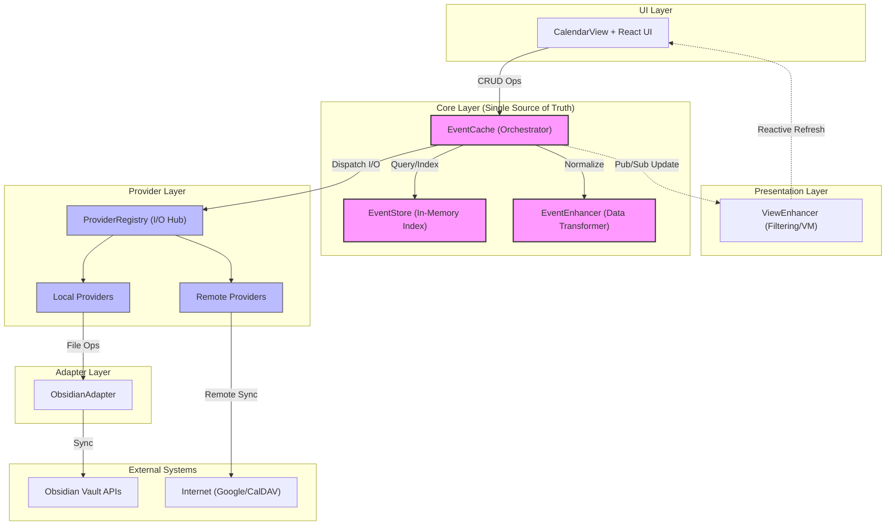

# System Overview

!!! abstract "System MOC"
    This page is the map of content for the **System** architecture fold. Use it to jump directly to the contract page you need, instead of scanning all architecture docs linearly.

## Quick Router (System Fold)

| If you need to understand... | Start here |
|---|---|
| Event-state ownership and mutation authority | [EventCache Contract](eventcache.md) |
| In-memory indexing and identifier mapping | [Event Storage and Identifiers](event-storage.md) |
| OFCEvent <-> FullCalendar conversion boundary | [FullCalendar Interop](interop.md) |
| External plugin API design and authorization | [API Architecture](api-architecture.md) |
| How to integrate another plugin via API | [API Integration Blueprint](api-integration-blueprint.md) |
| Runtime flow (load, mutate, external sync, tick/reminders) | [Data Flow](data-flow.md) |
| Core subsystem contracts and invariants | [Core Systems](core-systems.md) |
| Event-domain architecture scope | [Events Architecture](../events/architecture.md) |
| Safe extension workflow | [Extending the Plugin](extending.md) |
| Verification policy and docs-test alignment | [Testing and Validation](testing.md) |
| Scoping rules and packaging of stylesheets | [Styling Architecture & CSS Audit](styling.md) |

## Layer Model (At a Glance)

| Layer | Responsibility | Must Not Own |
|---|---|---|
| UI Layer | Capture user intent and render current state through views/modals. | Canonical state mutation rules.
| Presentation Layer | Apply workspace/view shaping and display-level overrides. | Provider I/O and persistence logic.
| Core Layer | Own event lifecycle, indexing, normalization, recurrence, and time-aware behavior. | Provider-specific protocol details.
| Provider Layer | Translate shared contracts into local/remote source reads and writes. | UI-specific decision making.
| Adapter Layer | Isolate Obsidian APIs behind testable abstractions. | Cross-module business rules.

## Stable Entry Points

Bootstrap and composition: `src/main.ts`  
State owner and orchestration: `src/core/EventCache.ts`  
Storage and indexing: `src/core/EventStore.ts`  
Provider routing: `src/providers/ProviderRegistry.ts`  
Workspace/view shaping: `src/core/ViewEnhancer.ts`

Compact index: [Overview](overview.md) · [EventCache](eventcache.md) · [Filtering & Sorting](event-filtering-sorting.md) · [Storage](event-storage.md) · [Interop](interop.md) · [API Architecture](api-architecture.md) · [API Blueprint](api-integration-blueprint.md) · [Data Flow](data-flow.md) · [Core Systems](core-systems.md) · [Features](features/index.md) · [ActivityWatch](../activitywatch/index.md) · [Providers](../calendars/architecture.md) · [Chrono](../chrono_analyser/architecture.md) · [Styling](styling.md)
