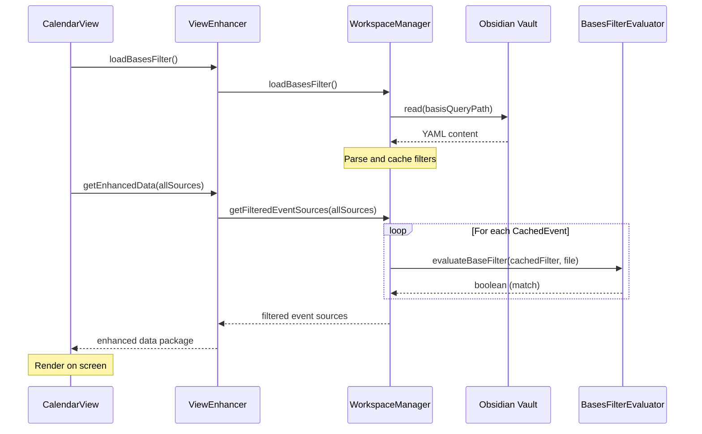

# Views Architecture

This page describes how calendar views are rendered, controlled, and filtered.

## Core Components

- **View Integration**: [`src/ui/view.ts`](file:///d:/Codes/plugin-full-calendar/src/ui/view.ts) manages the leaf lifecycles and initializes the presenter.
- **Presentation Enhancer**: [`src/core/ViewEnhancer.ts`](file:///d:/Codes/plugin-full-calendar/src/core/ViewEnhancer.ts) intercepts raw events and shapes them for presentation.
- **Workspace Manager**: [`src/features/workspaces/WorkspaceManager.ts`](file:///d:/Codes/plugin-full-calendar/src/features/workspaces/WorkspaceManager.ts) resolves active configurations and applies filters.
- **Advanced Query Evaluator**: [`src/features/workspaces/bases/BasesFilterEvaluator.ts`](file:///d:/Codes/plugin-full-calendar/src/features/workspaces/bases/BasesFilterEvaluator.ts) recursively parses and evaluates Obsidian Bases filters against note metadata.

---

## Design Boundaries

- View code is a "dumb" renderer focused on FullCalendar lifecycle and callbacks.
- On initialization (`onOpen`), `CalendarView` mounts its DOM frame and FullCalendar UI synchronously (<50ms) without blocking on event cache population or Bases filter loading.
- A top loading shimmer bar and a floating spinning status badge ("Syncing calendar events...") inform the user of background event population, automatically fading out upon completion.
- [`ViewEnhancer`](file:///d:/Codes/plugin-full-calendar/src/core/ViewEnhancer.ts) and [`WorkspaceManager`](file:///d:/Codes/plugin-full-calendar/src/features/workspaces/WorkspaceManager.ts) decouple data shaping and view configuration overrides from the presentation layer.
- Core event state is owned by the [`EventCache`](file:///d:/Codes/plugin-full-calendar/src/core/EventCache.ts), never by the views. `EventCache.populate()` uses in-flight promise locking to deduplicate concurrent sync requests.

---

## Data Flow: Workspace Bases Query Filtering

When a workspace is activated or refreshed:



### Live Updates

If a `.base` query file is edited in the workspace, the plugin's metadata change listener in [`src/main.ts`](file:///d:/Codes/plugin-full-calendar/src/main.ts) detects the file modification and triggers a cache resync:
```typescript
PluginState.getCache().resync();
```
This triggers a complete asynchronous query reload and view refresh.

---

## Related User Docs

- [Workspaces](../../user/views/workspaces.md)
- [Timeline View Usage](../../user/views/timeline_view.md)

