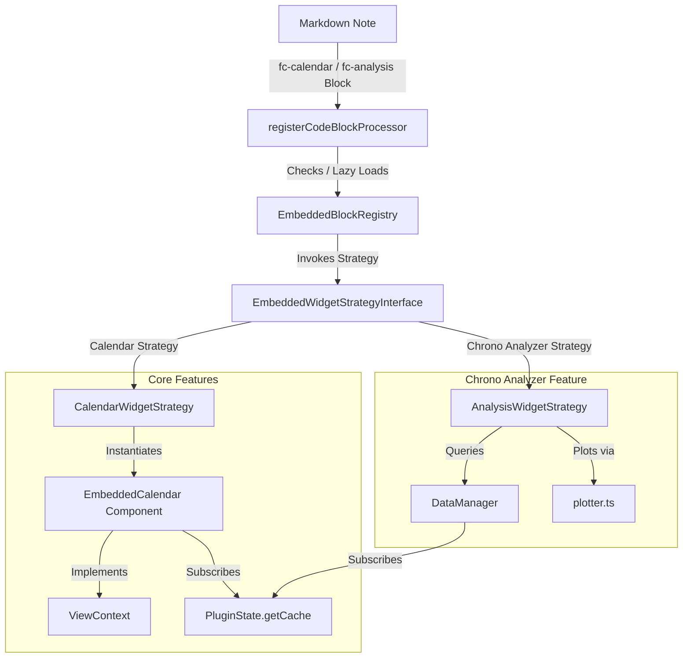

# Unified Embedded Widgets Architecture

This document describes the architectural design and structural patterns used to implement the flexible, high-performance **Unified Extensible Embedded Widget Framework** in Obsidian Full Calendar. This framework allows both calendar views (`fc-calendar`) and Chrono Analyzer productivity charts (`fc-analysis`) to render safely and reactively inside Obsidian notes.

---

## 1. Architectural Blueprint (Mermaid Diagram)



---

## 2. Core Architectural Design Patterns

The embedded widget framework adheres to strict modularity, SOLID principles, DRY (Don't Repeat Yourself), and reactive programming patterns.

### A. The Registry Pattern (Decoupling Features)
To prevent feature leak and keep the core plugin registry completely decoupled from individual visual features:
* **`EmbeddedBlockRegistry`**: Acts as a central static registry where features plug themselves in by registering an `EmbeddedWidgetStrategy` interface under a unique block name (e.g. `fc-calendar`, `fc-analysis`).
* **Boilerplate Reduction**: The generic processor handles Obsidian lifecycle attachments (`MarkdownRenderChild`), YAML configuration parsing, layout sizing (width, height), and lazy-loading observers (`IntersectionObserver`) globally. Strategies only focus on rendering.

### B. Polymorphic ViewContext & DRY Interactions
To avoid duplicating the extensive interaction logic (handling slot selections, context menus, dragging, rescheduling, and task toggles), the `EmbeddedCalendar` component implements the core `ViewContext` interface defined in `src/ui/calendar/ViewContext.ts`:

```typescript
export interface ViewContext {
  plugin: FullCalendarPlugin;
  app: App;
  containerEl: HTMLElement;
  contentEl: HTMLElement;
  inSidebar: boolean;
  get fullCalendarView(): Calendar | null;
  get viewEnhancer(): ViewEnhancer | null;
  refreshView(): Promise<void>;
}
```

By satisfying this interface, the calendar strategy can delegate **all** user event callbacks directly to the existing `ViewEventInteractionHandler` class without rewriting any event synchronization or vault editing logic.

### C. Isolated Chrono Analyzer Strategies (Pure Hooks)
In alignment with strict decoupling rules:
* All analytical plotting and calculation code resides strictly inside the `chrono_analyser/` directory.
* The Chrono Analyzer strategy (`AnalysisWidgetStrategy.ts`) registers itself in the registry via a dynamic hook: `registerChronoAnalysisStrategy(plugin)`.
* **Zero Plotter Modification**: By injecting hidden `<select>` elements directly into the widget's DOM structure, the strategy bridges the user’s YAML configurations seamlessly into Chrono Analyzer's existing plotter (`plotter.ts`), avoiding any duplicate plotting logic.

---

## 3. Performance & Resource Efficiency

1. **Dynamic Code Splitting**: FullCalendar and Plotly.js are heavy dependencies. The processor dynamically loads these bundles *only* when a code block mounts on the screen, preserving a fast startup speed for Obsidian.
2. **On-Demand Strategy Loading**: Chrono Analyzer's strategy is dynamically imported and registered only when an `fc-analysis` block enters the viewport, keeping memory footprints light.
3. **In-Memory Cache Subscriptions**: Instead of executing costly disk reads or re-parsing markdown, both strategies register as lightweight observers on the central reactive `EventCache` (`PluginState.getCache().on('update', callback)`).
4. **Metadata & Content Filtering**: Advanced filters (`titleFilter`, `tagFilter`, `pathFilter`) are applied directly in-memory during extraction, yielding maximum efficiency.
