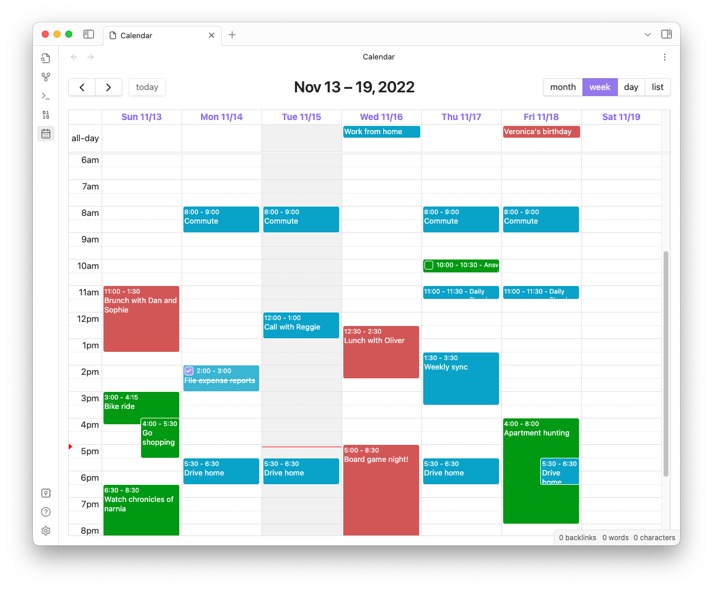

# Full Calendar (Remastered) Plugin

Keep your calendar in your vault! This plugin integrates the [FullCalendar.io](https://fullcalendar.io/) library into your [Obsidian vault](https://docs.obsidian.md/Plugins/Vault). Keep your schedule, events, and plans alongside your tasks and notes, and link freely between them.

!!! success "Courtesy and LICENSE"
    Remastered edition is a fork of the original [Full Calender plugin](https://github.com/obsidian-community/obsidian-full-calendar) by [Davis Haupt](https://davi.sh/) under [GNU license](https://github.com/obsidian-full-calendar-remastered/plugin-full-calendar?tab=License-1-ov-file#readme)

With Full Calendar, you can connect to [local note-based calendars](user/calendars/local.md), your [daily notes](user/calendars/dailynote.md), remote sources like [Google Calendar](user/calendars/gcal.md) with two-way sync, [CalDAV providers](user/calendars/caldav.md) (iCloud, Fastmail), local or remote [`.ics` files](user/calendars/ics.md), and even your [Obsidian Tasks](user/calendars/tasks-plugin-integration.md).

If you are new here or is looking for workflow guide head to [User Docs](user/index.md) / use the Search bar above (or press `S`), while if you are a veteran who wants to contribute or is just crazy to find joy in reading the core architecture jump to [Architecture Docs](architecture/system/index.md).

The latest release, **0.13.5**, expands the planning surface with **[Availability Sharing](user/features/availability.md)**, richer **[ICS Export](user/features/ics-export.md)** filters, **[Event Linked Notes](user/features/event-linked-notes.md)** presets and faster open-or-create flows, a refreshed **mobile UX**, and safer Google account scope handling alongside the existing **[unified task backlog](user/features/tasks-backlog.md)** and **[Google Tasks integration](user/calendars/gtasks.md)**.

For the most useful highlights and setup guidance, see **[What's New](whats_new.md)**. For complete version-by-version detail, see the **[Changelog](changelog.md)**.

This documentation site will guide you through setup and advanced features. If something is unclear, don't hesitate to [submit an issue on GitHub](https://github.com/obsidian-full-calendar-remastered/plugin-full-calendar/issues).

---

**See what's new:** [What's New](whats_new.md)  

**Full version history:** [Changelog](changelog.md)

**For advanced users:** [Data Integrity Notes](user/reference/data_integrity.md)

