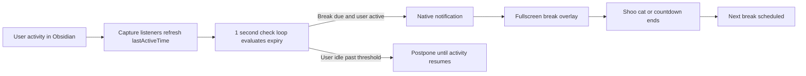

# Break Timer

!!! abstract "Feature Overview"
	Break Timer is a lightweight wellness feature that watches active use inside Obsidian and nudges you to rest at regular intervals. When the timer expires, it sends a native desktop notification and opens a fullscreen break overlay in the current Obsidian window.

> Inspiration and asset credits by [zokuzoku/cat-gatekeeper](https://github.com/zokuzoku/cat-gatekeeper) under MIT license.

## How It Works

Break Timer is stateful, idle-aware, and multi-window aware. The manager tracks activity in the main window, the active window, and any future popout windows. It listens to capture-phase events so user input is still detected even when editor surfaces stop event propagation.

!!! info "Captured Activity"
	The timer watches `mousedown`, `mousemove`, `keydown`, `scroll`, `touchstart`, and `click` events. That means the timer follows real interaction instead of only watching one editor pane.

### Runtime Behavior

| Condition | Result |
|---|---|
| You keep using Obsidian until the break interval expires | A system notification is sent and the fullscreen overlay opens. |
| You step away for longer than the idle reset threshold | The next break is pushed forward and the countdown does not interrupt you immediately when you return. |
| The break overlay countdown reaches zero | The overlay closes naturally and the next break is scheduled from that moment. |
| You click the close button | The overlay closes immediately and the timer is reset. |

!!! tip "What the overlay really is"
	The fullscreen overlay is video-backed, not ASCII art. If the two bundled WebM assets are present, the plugin uses them for the animation. If they are missing, the overlay falls back to a gradient background.

!!! note "First-run asset setup"
	When you enable Break Timer for the first time, the plugin checks for `assets_neko1.webm` and `assets_neko2.webm` inside the plugin assets folder and downloads them if needed. If the download fails, Break Timer still works, but the overlay uses the fallback visual treatment.

## Settings & Defaults

Open **Settings → General → Break Timer** to configure the feature.

| Setting | Default | Purpose |
|---|---:|---|
| **Enable break timer** | Off | Turns the feature on or off. |
| **Break interval (minutes)** | `60` | How long of active use must pass before the next break trigger. |
| **Idle reset threshold (minutes)** | `30` | How long you can stay inactive before the timer resets when you return. Set this to `0` to disable idle-based resetting. |
| **Break duration (seconds)** | `30` | How long the fullscreen overlay remains visible before auto-dismissal. |

!!! warning "Idle behavior matters"
	If the timer expires while you are already idle, it does not interrupt you with a break screen. Instead, the next break is postponed until you become active again.

## Manual Trigger

You can force the overlay at any time from Obsidian's command palette (`Ctrl + P` / `Cmd + P`) by running:

- `Trigger break timer overlay`

This immediately sends the notification, opens the fullscreen break screen, and starts the configured countdown.

---

### 📚 Related Resources

=== "User Docs"
	*   [Reminders and Notifications](reminders.md) — Standard event reminders and snooze behavior.
	*   [FCR Reminder Companion](fcr-reminder.md) — Native offline notification companion for event alerts.
	*   [Core Features](index.md) — Browse the rest of the user-facing feature guides.

=== "Technical Deep-Dives"
	*   [Break Timer Architecture](../../architecture/system/features/break-timer-architecture.md) — Manager lifecycle, activity capture, and overlay flow.
